# Rust SPICE Client-Server Communication Sequence Diagram

## Overview

This document describes the client-server communication flow as implemented in our Rust SPICE client codebase. The implementation follows the SPICE protocol specification and handles both native (TCP) and WebAssembly (WebSocket) transports.

## Architecture Components

### Client-Side Components

1. **SpiceClient** (`src/client.rs`): Main client orchestrator
   - Manages connections to multiple channels
   - Handles WebSocket and TCP transports
   - Coordinates channel lifecycle

2. **ChannelConnection** (`src/channels/connection.rs`): Low-level channel communication
   - Handles SPICE protocol handshake
   - Manages RSA encryption for authentication
   - Serializes/deserializes messages

3. **MainChannel** (`src/channels/main.rs`): Control channel
   - Establishes initial connection
   - Receives session ID and channel list
   - Handles ping/pong keepalive

4. **DisplayChannel** (`src/channels/display.rs`): Graphics channel
   - Receives display updates
   - Manages surfaces and streams
   - Handles video codec negotiation

5. **Transport Layer** (`src/transport.rs`): Abstraction over network
   - TCP transport for native builds
   - WebSocket transport for WASM builds

### Server-Side Components

The server is a standard SPICE server (e.g., QEMU with SPICE enabled) that:
- Listens on TCP port (typically 5900+)
- Supports multiple simultaneous channels
- Implements SPICE protocol v2.2

## Sequence Diagram

```mermaid
sequenceDiagram
    participant User as User/Application
    participant Client as SpiceClient
    participant Main as MainChannel
    participant Display as DisplayChannel
    participant Conn as ChannelConnection
    participant Transport as Transport (TCP/WS)
    participant Server as SPICE Server

    %% Connection Initialization
    User->>Client: new(host, port) / new_websocket(url)
    User->>Client: set_password(password)
    User->>Client: connect()
    
    %% Main Channel Connection
    rect rgb(240, 240, 240)
        Note over Main,Server: Main Channel Handshake
        Client->>Main: new(host, port)
        Main->>Conn: new(Main, channel_id=0)
        Conn->>Transport: create_transport()
        Transport->>Server: TCP/WebSocket Connect
        
        Conn->>Conn: handshake()
        Conn->>Server: SpiceLinkHeader {magic="REDQ", v2.2}
        Conn->>Server: SpiceLinkMess {channel_type=Main, caps}
        Server->>Conn: SpiceLinkHeader + SpiceLinkReplyData {error=0, RSA pubkey, caps}
        
        alt Has Password
            Conn->>Server: SpiceLinkAuthMechanism {auth=SPICE}
            Conn->>Conn: encrypt_password(RSA)
            Conn->>Server: Encrypted password
            Server->>Conn: Link result (4 bytes)
        end
        
        Main->>Main: initialize()
        Server->>Main: SPICE_MSG_MAIN_INIT {session_id}
        Main->>Server: SPICE_MSGC_MAIN_ATTACH_CHANNELS
        Server->>Main: SPICE_MSG_MAIN_CHANNELS_LIST
    end
    
    %% Display Channel Connection
    rect rgb(230, 240, 250)
        Note over Display,Server: Display Channel Setup
        Client->>Display: new_with_connection_id(session_id)
        Display->>Conn: new(Display, channel_id, connection_id)
        Conn->>Transport: create_transport()
        Transport->>Server: TCP/WebSocket Connect
        
        Conn->>Server: SpiceLinkHeader {connection_id=session_id}
        Conn->>Server: SpiceLinkMess {channel_type=Display, caps}
        Server->>Conn: SpiceLinkHeader + SpiceLinkReplyData
        
        alt Has Password
            Conn->>Server: SpiceLinkAuthMechanism {auth=SPICE}
            Conn->>Server: Encrypted password
            Server->>Conn: Link result (4 bytes)
        end
        
        Display->>Server: SPICE_MSGC_DISPLAY_INIT
        Server->>Display: Display configuration
    end
    
    %% Event Loop
    User->>Client: start_event_loop()
    Client->>Client: spawn tasks for each channel
    
    %% Main Channel Runtime
    rect rgb(250, 240, 230)
        Note over Main,Server: Main Channel Runtime
        loop Main Channel Event Loop
            Main->>Main: run()
            alt Server Message
                Server->>Main: SPICE_MSG_PING
                Main->>Server: SPICE_MSGC_PONG
            else
                Server->>Main: SPICE_MSG_MAIN_MOUSE_MODE
                Main->>Main: Update mouse mode
            else
                Server->>Main: SPICE_MSG_MAIN_AGENT_*
                Main->>Main: Handle agent messages
            end
        end
    end
    
    %% Display Channel Runtime
    rect rgb(240, 250, 230)
        Note over Display,Server: Display Channel Runtime
        loop Display Channel Event Loop
            Display->>Display: run()
            alt Surface Management
                Server->>Display: SPICE_MSG_DISPLAY_SURFACE_CREATE
                Display->>Display: Create surface
            else Drawing Commands
                Server->>Display: SPICE_MSG_DISPLAY_DRAW_*
                Display->>Display: Update surface
                Display->>User: Surface update callback
            else Stream Management
                Server->>Display: SPICE_MSG_DISPLAY_STREAM_CREATE
                Display->>Display: Setup video stream
                Server->>Display: SPICE_MSG_DISPLAY_STREAM_DATA
                Display->>Display: Decode & render
            end
        end
    end
    
    %% Common Messages (All Channels)
    rect rgb(250, 230, 240)
        Note over Conn,Server: Common Protocol Messages
        loop All Channels
            Server->>Conn: SPICE_MSG_SET_ACK
            Conn->>Conn: Update ACK window
            Server->>Conn: SPICE_MSG_NOTIFY
            Conn->>User: Log notification
            Server->>Conn: SPICE_MSG_DISCONNECTING
            Conn->>Conn: Close connection
        end
    end
    
    %% Disconnection
    User->>Client: disconnect()
    Client->>Client: Cancel all tasks
    Client->>Main: Drop channel
    Client->>Display: Drop channel
    Transport->>Server: Close connection
```



## Detailed Message Flow

### 1. Connection Establishment

The client initiates connection through these steps:

1. **Create SpiceClient instance**
   - Native: `SpiceClient::new(host, port)`
   - WASM: `SpiceClient::new_websocket(url)`

2. **Set authentication** (optional)
   - `client.set_password(password)`

3. **Connect to server**
   - `client.connect()`
   - Creates MainChannel first
   - Performs handshake with server

### 2. SPICE Protocol Handshake

Each channel connection follows this handshake sequence:

1. **Send Link Message** (`send_link_message`)
   - Header: `SpiceLinkHeader` with magic "REDQ", version 2.2
   - Message: `SpiceLinkMess` with channel type, ID, and capabilities
   - Capabilities: channel-specific caps (no MINI_HEADER support yet)

2. **Receive Link Reply** (`wait_for_link_reply`)
   - Server sends `SpiceLinkHeader` followed by `SpiceLinkReplyData`
   - Contains error code, RSA public key, and server capabilities
   - Client validates magic number and version
   - Client stores server capabilities for feature negotiation

3. **Authentication** (if password set)
   - Client sends `SpiceLinkAuthMechanism` selecting SPICE auth method
   - Client encrypts password using RSA-OAEP with SHA-1
   - Sends encrypted password to server
   - Reads 4-byte link result from server
   - Server validates and responds with success/error code

### 3. Main Channel Initialization

After handshake, the main channel:

1. **Receives SPICE_MSG_MAIN_INIT**
   - Contains session_id (connection identifier)
   - Display hints and mouse mode configuration
   - Agent connection status

2. **Sends ATTACH_CHANNELS**
   - Requests server to activate all channels

3. **Receives CHANNELS_LIST**
   - List of available channels (Display, Inputs, Cursor, etc.)
   - Client creates connections for each channel

### 4. Display Channel Operations

The display channel handles graphics:

1. **Surface Management**
   - CREATE: New drawing surface with dimensions and format
   - DESTROY: Remove surface
   - Primary surface (ID=0) is the main display

2. **Drawing Commands**
   - DRAW_COPY: Copy image data to surface
   - DRAW_FILL: Fill rectangle with color
   - DRAW_BLEND: Alpha blending operations

3. **Video Streaming**
   - STREAM_CREATE: Initialize video stream
   - STREAM_DATA: Compressed video frames
   - Supports MJPEG and other codecs

### 5. Message Serialization

Messages use binary format:

```rust
// Data header (18 bytes)
SpiceDataHeader {
    serial: u64,      // Message sequence number
    msg_type: u16,    // Message type ID
    msg_size: u32,    // Payload size
    sub_list: u32,    // Sub-message list offset
}
```

### 6. Transport Abstraction

The client supports multiple transports:

- **Native (TCP)**: Direct TCP socket connection
- **WASM (WebSocket)**: WebSocket for browser compatibility
  - Uses `web-sys` for browser WebSocket API
  - Binary message format
  - Optional authentication token support

### 7. Error Handling

The client handles various error conditions:

- Connection failures
- Protocol violations
- Authentication failures
- Channel-specific errors
- Graceful disconnection

## Key Implementation Details

1. **Async/Await**: All I/O operations are async using Tokio (native) or wasm-bindgen-futures (WASM)

2. **Channel Isolation**: Each channel runs in its own task/future

3. **Binary Protocol**: Uses `binrw` for serialization with little-endian byte order

4. **Capability Negotiation**: Client advertises supported features, server responds with mutual capabilities
   - Server capabilities stored in `server_common_caps` and `server_channel_caps`
   - Used for protocol feature detection (e.g., mini headers, compression methods)

5. **Flow Control**: ACK-based flow control prevents overwhelming the client

6. **Platform Abstraction**: Transport trait abstracts TCP vs WebSocket differences

## Common Message Patterns

1. **Ping/Pong**: Keepalive mechanism
   - Server sends PING with timestamp
   - Client echoes back as PONG
   - Prevents connection timeout

2. **ACK Flow Control**
   - SET_ACK: Server sets window size
   - Client sends ACK after processing N messages
   - Prevents buffer overflow

3. **Notifications**
   - Server sends NOTIFY for warnings/errors
   - Severity levels: Info, Warn, Error
   - Client logs or displays to user

## Recent Protocol Compliance Improvements

The following critical protocol compliance issues have been addressed:

1. **Authentication Mechanism Selection**: Now properly sends `SpiceLinkAuthMechanism` message before password
2. **Link Reply Parsing**: Uses proper `SpiceLinkReplyData` structure parsing instead of manual byte extraction
3. **Capability Storage**: Server capabilities are now stored and available for protocol decisions
4. **Link Result Handling**: Properly reads and validates the 4-byte link result after authentication
5. **Mini Header Support**: Removed advertisement of unsupported `SPICE_COMMON_CAP_MINI_HEADER` capability

These changes ensure the client follows the exact SPICE protocol specification for the handshake sequence:
1. Client → Server: `SpiceLinkHeader`
2. Client → Server: `SpiceLinkMess` + capabilities
3. Server → Client: `SpiceLinkHeader` + `SpiceLinkReplyData` + capabilities
4. Client → Server: `SpiceLinkAuthMechanism` (select SPICE or SASL)
5. Client → Server: Authentication data (encrypted password)
6. Server → Client: Link result (success/failure)

This architecture provides a robust, cross-platform SPICE client implementation that can run both as a native application and in web browsers while maintaining protocol compatibility with standard SPICE servers.