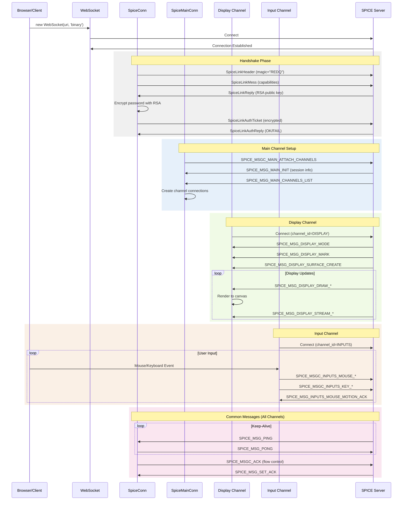

# SPICE HTML5 Client-Server Communication Flow Analysis

## Overview

This document provides a detailed analysis of the SPICE HTML5 client-server communication architecture based on the JavaScript codebase examination.

## Sequence Diagram



## Key Components

### 1. main.js - Main Client Initialization

**Key Classes/Functions:**
- `SpiceMainConn`: Master class for establishing and managing SPICE server connections
- Inherits from `SpiceConn` base class

**Connection Establishment:**
1. Creates WebSocket connection to SPICE server
2. Manages agent message queue and file transfer tasks
3. Handles channel creation for display, inputs, cursor, playback, and ports

**Message Flow:**
- `SPICE_MSG_MAIN_INIT`: Initial server response containing session info
- `SPICE_MSGC_MAIN_ATTACH_CHANNELS`: Client requests channel list
- `SPICE_MSG_MAIN_CHANNELS_LIST`: Server sends available channels
- Creates specialized connection objects for each channel type

### 2. spiceconn.js - Base Connection Logic

**Key Classes:**
- `SpiceConn`: Base class for all SPICE connections
- `SpiceWireReader`: Handles low-level message reading

**Connection Sequence:**
1. **WebSocket Creation**: `new WebSocket(uri, 'binary')`
2. **Handshake Process**:
   - Send header with capabilities (`send_hdr()`)
   - Receive server reply header
   - Send RSA-encrypted password ticket
   - Receive authentication reply
3. **State Machine**:
   - "connecting" → "start" → "link" → "ticket" → "ready"

**Message Processing:**
- `process_inbound()`: Handles incoming WebSocket data
- `process_channel_message()`: Channel-specific message handling
- `process_common_messages()`: Handles ACK, PING/PONG, NOTIFY

### 3. spicemsg.js - Message Structures

**Key Message Classes:**
- `SpiceLinkHeader`: Initial connection header (magic, version, size)
- `SpiceLinkMess`: Channel connection request
- `SpiceLinkReply`: Server's reply with RSA public key
- `SpiceLinkAuthTicket`: Encrypted password ticket
- `SpiceMiniData`: Generic message wrapper

**Protocol Structure:**
```javascript
// Link Header (16 bytes)
{
    magic: "REDQ" (4 bytes),
    major_version: uint32,
    minor_version: uint32,
    size: uint32
}

// Mini Message Format (6 bytes header)
{
    type: uint16,
    size: uint32,
    data: ArrayBuffer
}
```

### 4. wire.js - Low-Level Communication

**Key Class:**
- `SpiceWireReader`: Manages WebSocket message buffering and assembly

**Functionality:**
- Buffers incoming WebSocket messages
- Assembles fragmented messages
- Optimized for handling both small and large messages
- Maintains message boundaries

**Message Flow:**
1. WebSocket `onmessage` → `wire_blob_catcher()`
2. `inbound()`: Buffers or processes complete messages
3. `request(n)`: Sets expected message size
4. Calls callback when complete message is assembled

### 5. inputs.js - Input Channel Communication

**Key Class:**
- `SpiceInputsConn`: Handles keyboard and mouse events

**Message Types:**
- `SPICE_MSGC_INPUTS_MOUSE_MOTION`: Relative mouse movement
- `SPICE_MSGC_INPUTS_MOUSE_POSITION`: Absolute mouse position
- `SPICE_MSGC_INPUTS_MOUSE_PRESS/RELEASE`: Mouse button events
- `SPICE_MSGC_INPUTS_KEY_DOWN/UP`: Keyboard events

**Flow Control:**
- Motion ACK mechanism to prevent flooding
- Waits for `SPICE_MSG_INPUTS_MOUSE_MOTION_ACK`
- Discards excess motion events

### 6. display.js - Display Channel Communication

**Key Class:**
- `SpiceDisplayConn`: Manages display rendering

**Message Types:**
- `SPICE_MSG_DISPLAY_MODE`: Display configuration
- `SPICE_MSG_DISPLAY_DRAW_COPY`: Copy image operations
- `SPICE_MSG_DISPLAY_DRAW_FILL`: Fill operations
- `SPICE_MSG_DISPLAY_SURFACE_CREATE/DESTROY`: Surface management

**Image Handling:**
- Supports multiple formats: QUIC, JPEG, Bitmap, LZ
- Image caching mechanism
- Surface-to-surface copying
- Alpha channel support

## Overall Communication Architecture

```
Client (Browser)                    Server (SPICE)
     |                                   |
     |------ WebSocket Connect --------->|
     |                                   |
     |<----- Link Header Exchange ------>|
     |                                   |
     |------ Send Capabilities --------->|
     |<------ Reply + Public Key --------|
     |                                   |
     |-- Send Encrypted Password ------->|
     |<----- Auth Reply (OK/FAIL) -------|
     |                                   |
     |---- Attach Channels Request ----->|
     |<---- Channels List Reply ---------|
     |                                   |
     |==== Create Channel Connections ===|
     |                                   |
     |<--- Channel-Specific Messages --->|
     |     (Display, Input, etc.)        |
```

## Key Design Patterns

1. **Inheritance Hierarchy**: 
   - `SpiceConn` base class → Specialized channel classes

2. **State Machine**: 
   - Connection states managed through string-based state tracking

3. **Message Queue**: 
   - Agent messages queued until tokens available

4. **Binary Protocol**: 
   - Uses ArrayBuffer and DataView for binary data handling

5. **Event-Driven**: 
   - WebSocket events drive the communication flow

6. **Capability Negotiation**: 
   - Client and server exchange supported features

## Communication Aspects Summary

1. **WebSocket Transport**: All communication happens over a binary WebSocket connection
2. **Authentication**: RSA-encrypted password exchange during handshake
3. **Channel Architecture**: Main channel coordinates creation of specialized channels (display, input, cursor, etc.)
4. **Binary Protocol**: Uses ArrayBuffer/DataView for efficient binary message handling
5. **Flow Control**: ACK window mechanism prevents overwhelming the client
6. **State Machine**: Connection progresses through well-defined states
7. **Event-Driven**: Browser events trigger protocol messages, server messages trigger UI updates

This architecture provides a clean separation between transport (WebSocket), protocol (SPICE messages), and application logic (channels), making it modular and maintainable.